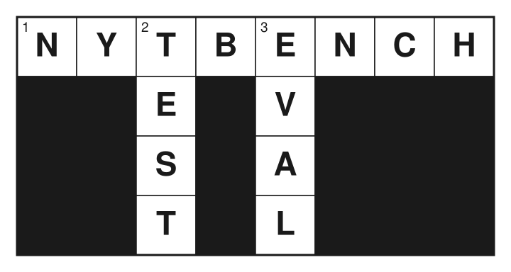

<div align="center">



**An apples-to-apples benchmark for LLM crossword solvers**

[](https://www.python.org/)
[](https://github.com/langchain-ai/langgraph)
[](https://www.nytimes.com/crosswords)
[](LICENSE)

</div>

---

## Overview

LLMs have seen great success on benchmarks regarding general quantitative thinking. What about for a challenge that requires out-of-the-box, intuitive reasoning? `nytbench` evaluates LLM-based agents on a curated, stratified set of NYT crossword puzzles under a controlled, reproducible environment. Every agent receives identical puzzle states, an identical action space, and is scored by an identical grader — eliminating prompt-format advantages and ensuring fair model comparison.

## Project Structure

```
nytbench/                     # NOTE: no puzzle data ships with this repo —
├── data/                     #       every data/ subdir below is git-ignored
│   ├── raw_puz/              # Raw puzzle downloads from the NYT API
│   ├── processed_json/       # Machine-readable JSON puzzle states
│   ├── filtered_json/        # Puzzles passing the contamination/format filters
│   └── stratified_splits/    # Puzzles organized by weekday difficulty
├── src/
│   ├── pipeline/             # Data curation and preprocessing
│   ├── environment/          # Custom crossword referee/simulator
│   ├── agent/                # Standardized LangGraph agent scaffolding
│   └── evaluation/           # Grading and metrics
└── scripts/
    ├── build_dataset.py      # End-to-end dataset construction
    └── run_benchmark.py      # Agent evaluation entry point
```

## Setup

```bash
pip install -r requirements.txt
```

## Building the Dataset

**No puzzle data is distributed with this repository.** NYT crossword content is
licensed by The New York Times, so every `data/` subdirectory is git-ignored and
must be built locally by each user from their own NYT Games subscription.

1. Sign in to your NYT Games subscription and provide credentials via environment
   variables — either a session cookie or an email/password pair:

   ```bash
   # Option A: paste the value of the `NYT-S` cookie from a logged-in browser session
   export NYT_COOKIE="<your NYT-S cookie value>"

   # Option B: let the scraper log in for you
   export NYT_EMAIL="you@example.com"
   export NYT_PASSWORD="..."
   ```

2. Run the build, which downloads, parses, filters, and stratifies puzzles into
   `data/`:

   ```bash
   python scripts/build_dataset.py            # Feb 1 2026 → today
   python scripts/build_dataset.py --sync     # incremental top-up
   ```

See [src/pipeline/scraper.py](src/pipeline/scraper.py) for the download details.

## Zero-Contamination Rules

1. **Date floor**: Only puzzles published **on or after February 1, 2026** are included. Puzzles before this date risk appearing in model training corpora and are excluded.
2. **No rebus puzzles**: Puzzles requiring multi-character squares are discarded to keep the action space uniform.
3. **No human hints**: The agent receives only the clue list and the current board state — no external puzzle databases or answer lists are injected.
4. **Frozen scaffolding**: Within an agent track (see below), the action space and prompts are identical across all evaluated models.

## Agent Tracks

`nytbench` ships two agent designs. Both are **model-agnostic** — every model is driven through the same `llm(system, messages) -> str` callable, so a run fixes one model and any cross-model comparison *within a track* stays apples-to-apples. The two tracks differ in their scaffolding, so comparing a model across tracks is an agent-vs-agent comparison, not a model-vs-model one.

| Track | Module | Scaffolding |
|---|---|---|
| **Baseline** | [src/agent/loop.py](src/agent/loop.py) | A single neutral system prompt and a frozen action space (`GET_CLUE`, `WRITE`, `ERASE`). No per-model or per-clue prompt tuning — the low-effort reference. |
| **Multi-agent** | [src/agent/multi/](src/agent/multi/) | Five role-specialized nodes mirroring the human solving arc: a **Syntax Extractor** turns each clue into a strict grammatical spec, a **Sprinter** locks in high-confidence gimmes/fill-in-the-blanks, a **Pattern Matcher** and **Lateral Thinker** fill constrained and wordplay slots, and an **Eraser** backtracks on crossing conflicts. |

Report the two tracks as separate leaderboards. `run_benchmark.py` currently drives the multi-agent track.

## Quickstart

```bash
# Initial build — scrapes Feb 1 2026 → today, filters, and splits by weekday
python scripts/build_dataset.py

# Incremental update — only downloads puzzles not yet on disk, then re-runs all steps
python scripts/build_dataset.py --sync

# Run a benchmark against Monday puzzles
python scripts/run_benchmark.py --day monday --model claude-sonnet-4-6 --puzzles 50
```

## Models

Any model is driven through the same `llm(system, messages) -> str` callable, so the field is open-ended. The provider is selected by the `--model` prefix:

| Provider | `--model` prefix | API key env var | Example |
|---|---|---|---|
| Anthropic | `claude*` | `ANTHROPIC_API_KEY` | `claude-opus-4-8`, `claude-sonnet-4-6` |
| OpenAI | `gpt*` / `o*` | `OPENAI_API_KEY` | `gpt-5`, `o4-mini` |
| Google | `gemini*` | `GOOGLE_API_KEY` | `gemini-2.5-pro` |
| OpenRouter (passthrough) | `openrouter/<provider>/<model>` | `OPENROUTER_API_KEY` | `openrouter/x-ai/grok-4`, `openrouter/deepseek/deepseek-r1` |
| Ollama (local, free) | `ollama/<model-tag>` | none (local daemon) | `ollama/qwen2.5:7b`, `ollama/llama3.2` |

The **OpenRouter passthrough** reaches almost any hosted model (Grok, DeepSeek, Llama, Qwen, Mistral, …) through one OpenAI-compatible endpoint — everything after the `openrouter/` prefix is sent verbatim as the OpenRouter model id. Note: Fable 5 cannot be used due to the recent rollback.

The **Ollama** route runs open-source models **locally — free, no API key, no rate limits**. Install [Ollama](https://ollama.com), `ollama pull <model>`, then pass `ollama/<model-tag>`. Override the host with `OLLAMA_BASE_URL` (default `http://localhost:11434/v1`). Model size is bounded by your RAM (≈7B fits 16 GB; 70B+ needs ~48 GB).

### Fair-comparison flags

Two `run_benchmark.py` flags keep model comparisons apples-to-apples:

```bash
python scripts/run_benchmark.py --day saturday --model gpt-5 \
    --max-tokens 8192 \      # per-call output budget, applied identically to every provider
    --temperature 0          # optional; omit for reasoning models that reject sampling params
```

- `--max-tokens` (default `4096`) is applied identically across providers, so no model gets a smaller or unbounded output budget than another. Keep it generous — reasoning models spend output tokens on internal thinking before emitting an action.
- `--temperature` is **omitted by default** and only forwarded when set. Current Claude reasoning models (Opus 4.7/4.8, Fable 5) reject sampling parameters, so pass it only for backends that accept it (OpenAI base chat, Gemini, Sonnet, most OpenRouter models).

> **Note:** This is an English, US-centric puzzle set. Models trained predominantly on non-US-English corpora start at a knowledge-coverage disadvantage that is independent of raw reasoning ability — worth stating when reporting cross-model results.

## Metrics

| Metric | Description |
|---|---|
| `solve_rate` | Fraction of puzzles solved with 100% correct squares |
| `fill_rate` | Average fraction of squares correctly filled |
| `turns` | Mean number of agent turns per puzzle |
| `tool_calls` | Mean number of external tool invocations per puzzle |

## Stratified Splits

Puzzles are split by publication day (Monday–Sunday) as a proxy for difficulty. Each split targets at least 50 puzzles per day.

### Flow Metric

Each puzzle is annotated with a **Flow** score: the fraction of white squares that sit at the intersection of an Across and a Down answer. Higher Flow means denser crossing constraints — a useful continuous difficulty signal that complements the weekday proxy.

> Flow metric concept derived from statistics published by [XWord Info](https://www.xwordinfo.com), an indispensable reference for NYT crossword analysis. XWord Info is the work of Jim Horne and is not affiliated with this project.

## Attribution

Puzzle files are downloaded from the New York Times Games archive and require a valid NYT subscription. The NYT crossword is a registered trademark of The New York Times Company. This project is an independent research benchmark and is not affiliated with or endorsed by the New York Times.
